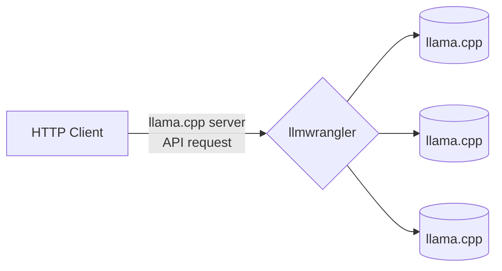

# LLaMA Wrangler

`llmwrangler` passes API requests through to [llama.cpp](https://github.com/ggerganov/llama.cpp/)'s [server](https://github.com/ggerganov/llama.cpp/tree/master/examples/server), routing requests to the least-encumbered instance.

This might be useful if you have a variety of hardware and want to maximize total throughput.



TODO:
- [ ] Automate management based on host online/offline status

## Build
1. Run `go build`

## Usage
```
Usage of ./llmwrangler:
  -listen int
        Port to listen on (default 7000)
  -llmhost string
        (optional) hostname:port for llama.cpp server
  -warmup-prompt-file string
        Prompt text file used to warm up llama.cpp (default "prompt.txt")
```

Example: `./llmwrangler -listen 7000 -warmup-prompt-file /prompts/warmup_prompt.tpl -llmhost llamacppHostname:8080`

After the wrangler has started, navigate to http://localhost:7000/wrangler to add/remove llama.cpp server hosts. 

## Premise and Strategy
I'm a bit desperate for more tokens-per-second from llama.cpp, and my old 2017 server CPUs can add 20 t/s of throughput.

Given that a GPU can respond within 300 ms and a (warmed up) CPU takes 3,000 ms, we can count backlogged requests for the GPU until `#_of_requests` * `response_time` exceeds the CPU response time. When the GPU is sufficiently backlogged, the CPU handles a little bit of overflow.

Warming up the llama.cpp KV cache with your prompt is necessary to improve response time for the first N requests, where N is the number of slots configured in llama.cpp. Without this warmup, initial response times would be so high that it would never be worth using a CPU for this purpose. `llmwrangler` handles this warmup by running N+1 requests: N to fill the cache and 1 more to get the warmed up response time.
